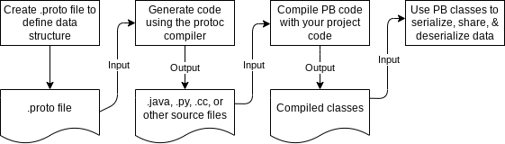

<h1>

</h1>
<h2>
Protobuf for game dev
</h2>

**Protocol Buffers** by `google-protobuf` 

# Introduce
应用于 cocos-creator, unity, UE

Contents
--------

@see https://github.com/protocolbuffers/protobuf-javascript